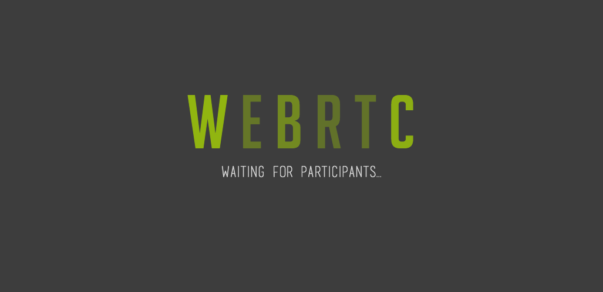

dart-webrtc
===========
A clean and simple proof of concept for webrtc in dart.

How to get started:

1. Install dart from https://www.dartlang.org/ and make sure the dart binaries are available in $PATH.
2. Compile the client dart code using the devmode script available in /www:
> ```
> $ ./www/devmode ./www/index.dart # Press ctrl+c to exit
> Watching for changes in './www/index.dart' every 2 sec.
> Redirecting dart2js logs to devmode.log
> [Fri Feb  7 15:28:11 CET 2014] Compiling... done
> ```

3. Start the server:
> ```
> $ dart server.dart
> Starting server
> Listening for connections at 0.0.0.0:1337
> ```

4. Browse to http://localhost:1337 and you should see the following page:
> 
